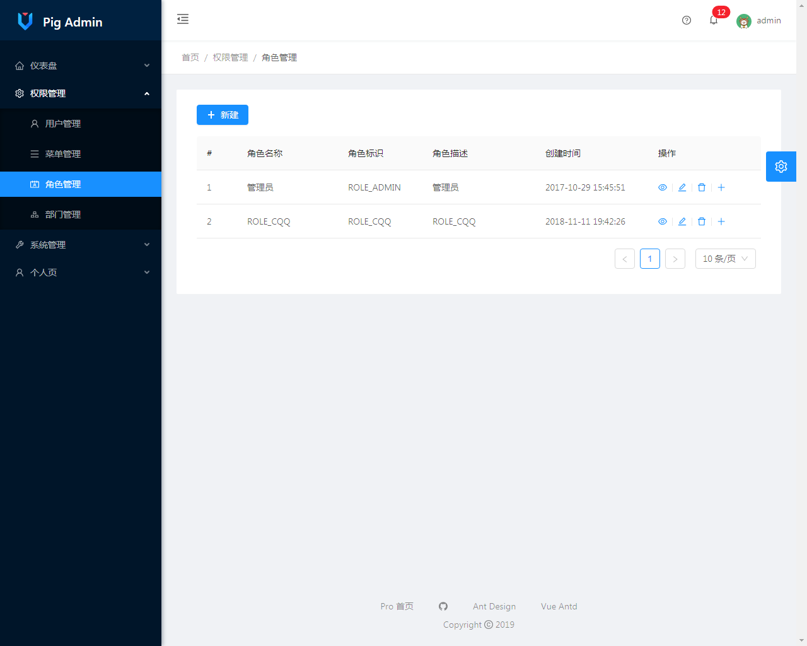
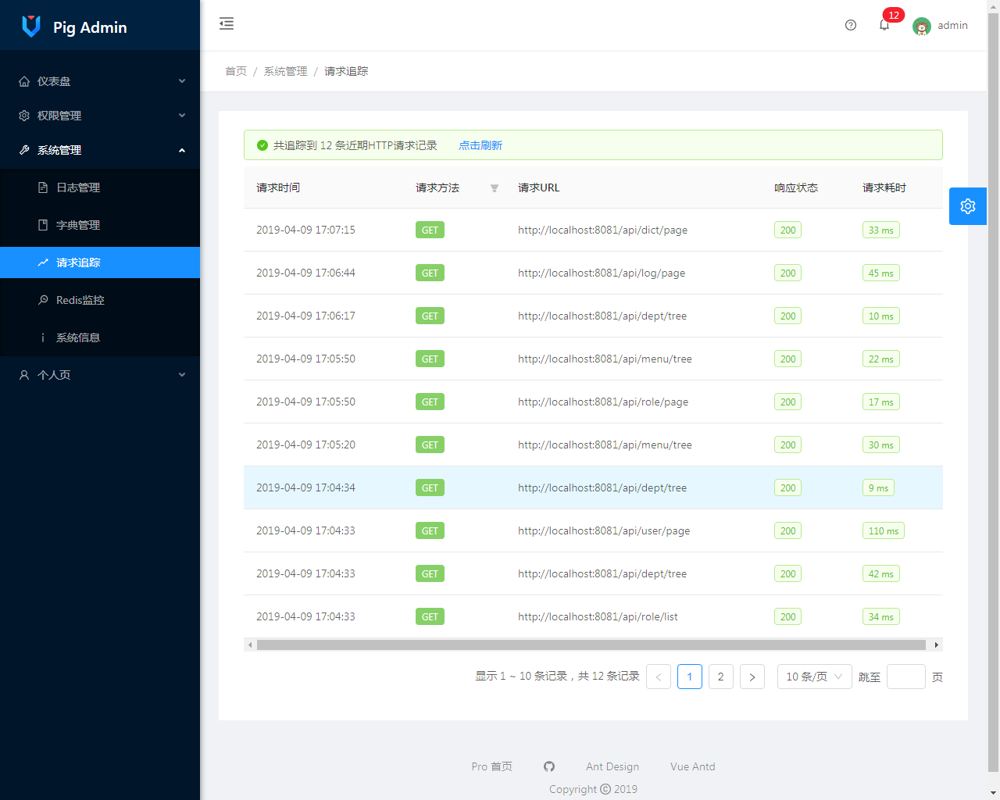

前后端分离后台管理系统，前端使用Vue全家桶，组件库采用[Ant-Design-Vue](https://vuecomponent.github.io/ant-design-vue/docs/vue/introduce-cn/)

本地部署账号密码：

账号 | 密码| 权限
---|---|---
admin | admin | 超级管理员


### 使用教程

#### 后端

1. IDEA 或者 Eclipse安装lombok插件

2. 新建MySQL（版本5.7.x）数据库，导入[SQL](https://github.com/a0953245782/pig-admin/blob/master/backend/src/main/resources/db.sql)文件
                                         

3. 导入[backend项目](https://github.com/a0953245782/pig-admin/tree/master/backend)

4. 修改数据库配置，redis配置，等待Maven下载依赖

5. 启动backend项目

#### 前端

1. 安装node.js

2. 切换到frontend文件夹下
```
# 安装yarn
npm install -g yarn

# 下载依赖
yarn install

# 启动
yarn serve
```

### 系统预览








### 鸣谢

感谢以下优秀的开源项目：

- [ant-design-vue](https://github.com/vueComponent/ant-design-vue)

- [ant-design-pro](https://pro.loacg.com/docs/getting-started)

- [mybatis-plus](https://github.com/baomidou/mybatis-plus)

- [pigx](https://gitee.com/log4j/pig)

- [FEBS-Vue](https://github.com/wuyouzhuguli/FEBS-Vue)
